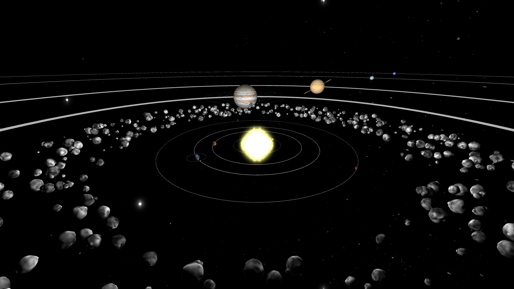

# Système solaire
### Kévin Trancho - Victor Veillerette



To compile :
```
	mkdir build
	cd build
	cmake ../
	make
```
To execute :
```
	./app/main
```
To execute with mesa version :
```
	MESA_GL_VERSION_OVERRIDE=3.3 ./app/main
```

Directories :
 * app : Source code
 * assets : Textures and Solar System informations
 * docs : Report of the project
